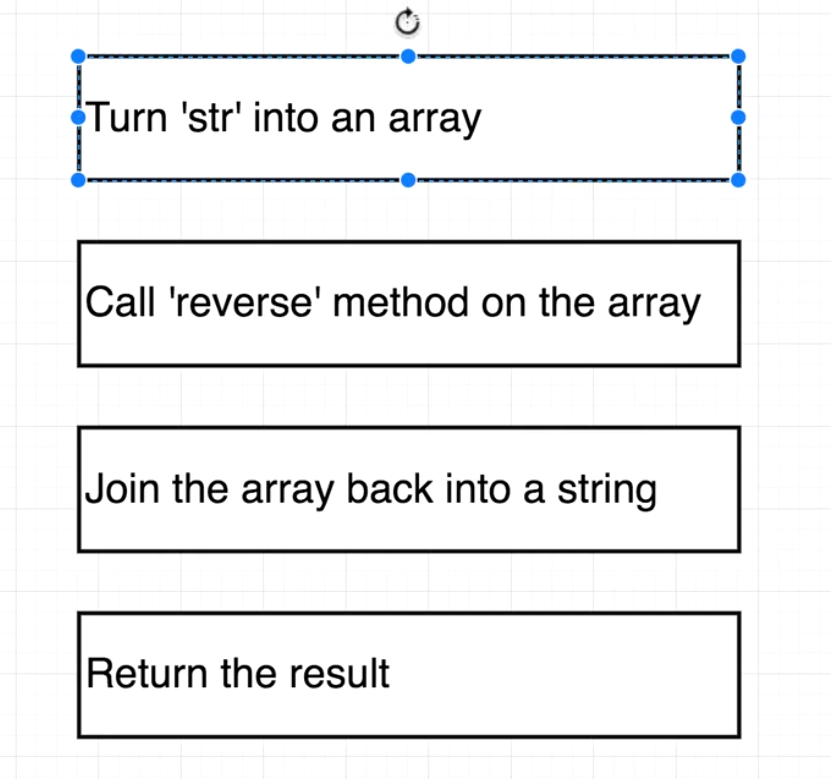
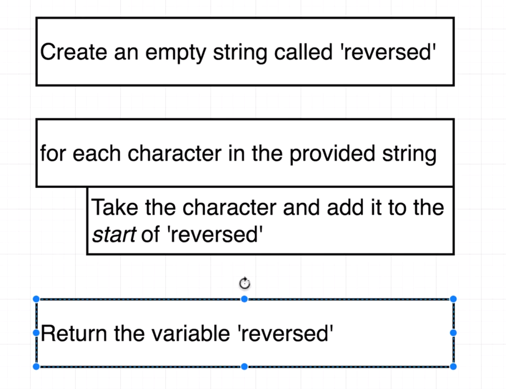
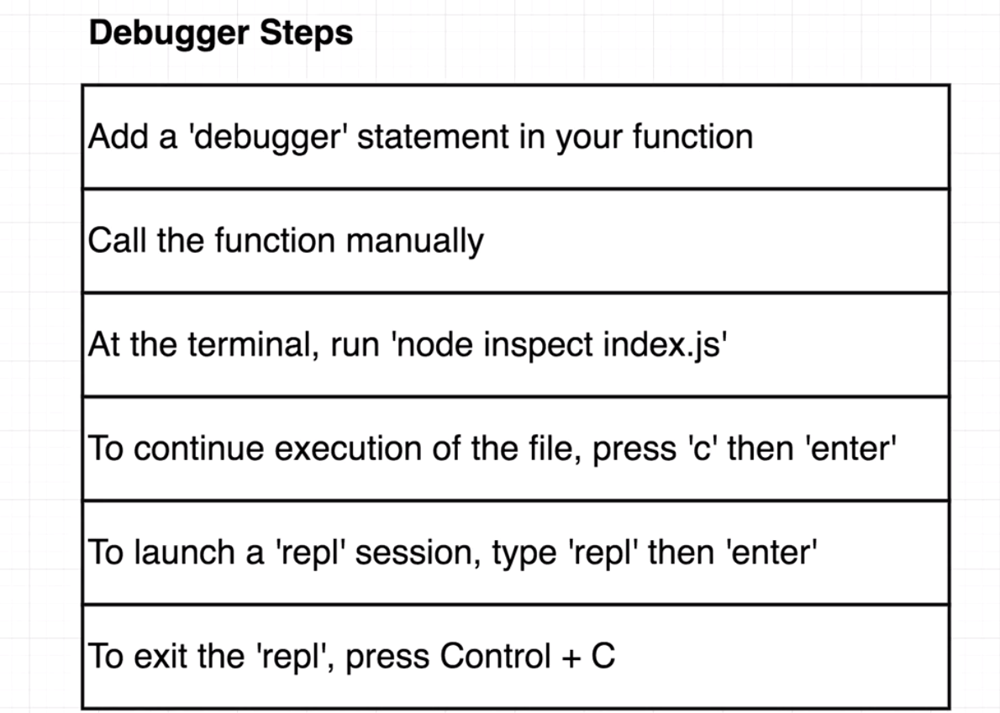

## Solution 1 (using built in array method)



```
function reverse(str) {
    return str
      .split('')
      .reverse()
      .join('');
  }

```

## Solution 2 (w/o using built-in array reverse method



### (using classic for-loop - not recommended due to errors that you may introduce due to interview hibee jibee)

```
    function reverse(str) {
        let reversed = '';
        for (let i = str.length - 1; i >= 0; i--) {
          reversed += str[i];
        }

        return reversed;
      })


```

### (Recommended using modern for-of loop)

```
function reverse(str) {
  let reversed = '';
  for (let char of str) {
    reversed = char + reversed;
  }

  return reversed;
}

```

### (using reduce helper)

```
function reverse(str) {
  return str.split('').reduce((rev, char) => char + rev, '');
}

```

## Debugging


